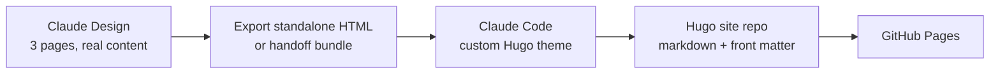

# Personal Website Redesign Brief

2026-09-19 · @Someone

## Purpose and audiences

The site has two jobs: answer "what question is this person chasing, and can they think?" in 20 seconds, and give a reader one deep thing worth 10 minutes. The current site ([andalibmalit.github.io](https://andalibmalit.github.io)) does neither: the homepage is a résumé in prose, and the research page lists seven projects at equal weight with no dates or hierarchy.

Three audiences, weighted equally:

| Audience | What they need in 20 seconds | What they read for 10 minutes |
| --- | --- | --- |
| AI safety hiring managers and researchers | A clear stance, current work, evidence of rigor | One selected research piece with a link to paper, code, or post |
| Collaborators on flourishing and first-person methods | The signal that first-person methods and contemplative science are live interests | The current question and its status |
| General readers and newsletter people | A person, not a CV; a way to keep reading | The Writing page and the Substack link |

What gets dropped: the Resume page (replaced by one CV PDF link in the footer), the `~/` terminal-style nav, and the grey background.

## Voice and positioning

The stance the whole site sits under, in Andalib's words: putting real rigor behind things whose importance you can already feel, so the numbers sharpen that feeling but don't replace it. It covers evaluation work, HPC pipelines, and the spiritual-engagement benchmark without strain, so it opens the homepage. Compressed form, for a tagline or page description: rigor that sharpens the felt sense instead of hiding it.

The contemplative side appears as practice and questions, never as affiliation. A meditation practice is named as something that informs interests in human flourishing, first-person methods, and rigor applied to lived experience. No tradition, school, or teacher is named, and no belief is stated.

Why that line: two résumé field experiments found that any religious affiliation cue cut employer callbacks by roughly a quarter, with unfamiliar affiliations hit hardest ([Wright et al. 2013](https://www.sciencedirect.com/science/article/abs/pii/S0276562413000413), [Wallace et al. 2014](https://dx.doi.org/10.1177/2329496514524541)). The cost attaches to the affiliation cue, not to intellectual interest. Framing the interest as methods and questions protects the hiring read and is also the more honest description of the work.

Voice rules for all copy:

- Plain, sincere, full sentences. No polished or clever copywriting.
- First person, warm, specific. Numbers and names over adjectives.
- Say what is unfinished. A status label beats a disclaimer.
- Enthusiasm comes from content (a live question, dated progress), never from chrome.

## Site map

Three pages and a footer. The blog stays on Substack.

| Page | Contents | Notes |
| --- | --- | --- |
| Home | Stance line; what I do now; practice-to-interests nod; current question with status; 2–3 selected pieces; short News list | The 20-second read. Everything else lives one click away |
| Research | Selected work (2–3 items, one paragraph and one labelled link each; no images) above a compact list of earlier work | Entry schema in the Research page spec below |
| Writing | At launch: no Writing page; the nav item links to Substack. Later: the page is enabled with the research-agenda post (why), and the public proposal doc (how) is linked from the Research entry | Hosts long-form pieces that should outlive a newsletter issue |
| Footer (every page) | CV (PDF), email, GitHub, LinkedIn | CV is a generic version, updated twice a year |

Nav is one lowercase line: andalib samandari · research · writing, with the light/dark switch at the right end. The name is the home link. No icons.

Content to fix while migrating: the homepage says HumaneBench was adopted by Chief.bot, the research page says Storytell.ai; pick the current one. Drop "Andalib's face circa 2023" as alt text and use a recent photo, or no photo.

## Homepage bio draft

Five paragraphs above the fold, about 190 words. Andalib's final version of Sept 19: the stance, ARCTIC, his own research, the practice, the question.

```markdown
I like putting real rigor behind things whose importance you can already feel, so the numbers sharpen that feeling but don't replace it. In practice, that means two kinds of work.

At Georgia State's ARCTIC HPC center, I run AI infrastructure for researchers — building LLM-assisted cluster observability tools; helping scale up researchers' experiments on our cluster; and leading workshops to democratize ML/AI and other computational methods.

My own research is wellbeing evaluation of frontier models: benchmark design, working out what to measure and why, LLM-judge validation. I co-architected and led research on [HumaneBench](https://humanebench.ai/), an adversarial evaluation of prosocial behavior in 15 frontier models.

I've also kept a daily meditation practice for years. It shapes my interests in human flourishing, first-person methods, and how felt experience and formal frameworks can inform each other rather than be in tension.

A question I recently started asking: can LLMs safely and supportively facilitate first-person exploration of spirituality? As a starting point, I'm exploring whether anti-delusion training also suppresses engagement with reports of spiritual experience.
```

Below the fold: two or three selected pieces (title, one line, link), then News as a short dated list. The bio's third move is the only place the practice is mentioned on the site.

## Research page spec

The page has two tiers: Selected (2–3 entries, one paragraph and one labelled link each; no images) and Everything else (a compact list: title, year, one line, link). Every entry carries a year and a status, so unfinished work reads as in progress rather than as a claim.

Status labels are the plain words academics already use, so unfinished work reads as in progress rather than as a claim. Garden vocabulary (Seedling, Settled) was tried and dropped: it read as pretentious in the mockups.

| Status | Meaning |
| --- | --- |
| Proposal | A question and a design; no results yet |
| In progress | Data or code exists; results are partial |
| Published | Published, presented, or in production use |

Proposed placement of the current seven projects:

| Entry | Tier | Year | Status |
| --- | --- | --- | --- |
| LLM delusion-mitigation vs spiritual engagement (current question) | Selected (draft at launch) | 2026 | Proposal |
| HumaneBench | Selected | 2025 | Published |
| Multiple imputation at HPC scale (NIBRS) | Selected | 2025 | In progress |
| Econometric pipelines at HPC scale (323M job postings) | List | 2026 | Published |
| Causal inference on TikTok firearm discourse | List | 2024 | Published |
| Agent-based model of firearm acquisition | List | 2023 | Published |
| RL for microgrid energy trading (Microsoft Research) | List | 2022 | Published |
| Predator–prey dynamics with a parasite (REU) | List | 2022 | Published |

Each entry is one markdown file whose front matter holds title, year, status, tier, one-liner, and links; the page renders from that, so adding work means adding a file. At launch the current-question entry has a status and no link; the public proposal doc is linked when it exists.

Selected paragraph for the current question, Andalib's to edit. Add this sentence after "judged on discernment and support rather than topic avoidance": If the suppression is real, it's a miscalibrated guardrail rather than a safety win: people who can't talk about their experience with the model don't stop having it, they route around the model.

## Design direction

Superseded in part by the Claude Design handoff of Sept 20 (design/handoff/README.md in the repo), which is authoritative where it differs from this section. Changes made in Claude Design: dark is the default palette, with the light set behind a plain-text switch in the nav; fonts are Rasa and IBM Plex Mono, self-hosted; the photo is a full-width 5:4 frontispiece under the name, not a small square; the nav's "writing" item links to Substack and there is no Writing page at launch. Later handoff revisions (Sept 20): no images on the Research page; link lines are labelled by type (Paper, Poster, Slides, Video, Blog post) in the metadata style and may hold several links; the NIBRS imputation project replaced the econometric pipelines as the third Selected entry, with a link to the ARCTIC story; the Talks block from the old site was cut as internal. The rules below on space, chrome, measure, and copy still hold.

Text-centric, warm, and quiet: the page should feel like a well-set book, not a portfolio. Four traditions inform it, each reduced to what survives on a screen.

| Tradition | What it contributes | What to leave out |
| --- | --- | --- |
| Ma, kanso, shibui (Japanese aesthetics) | Space as respect for the words; remove anything whose absence makes the rest speak louder; nothing loud | Grain textures, blob shapes, earth-tone theming; the "wabi-sabi web" is mostly a Western projection ([Utsubo](https://www.utsubo.com/blog/japanese-web-design-style-guide)) |
| Practical Typography (Butterick) | Body 15–25px, line height 120–145%, 45–90 characters per line, one professional font ([summary](https://practicaltypography.com/summary-of-key-rules.html)) | Anything the measure and leading don't fix first |
| Digital garden (Appleton) | Work shown at its real stage, with a year and a plain status on every entry ([essay](https://maggieappleton.com/garden-history)) | Backlink graphs, wiki sprawl, and the garden vocabulary itself |
| Shaker plainness | Make it only if necessary and useful; then make it beautiful | Decoration of any kind |

Concrete rules for Claude Design:

- Background warm off-white (around #FAF8F3), text near-black (around #1F1D1A), one muted accent for links only. No pure white, no grey, no dark mode toggle in v1.
- One serif for body and headings (Source Serif, Charter, or ET Book); system sans for nav and labels. Two type sizes for headings at most, barely larger than body.
- Measure about 65 characters; line height 1.5; generous vertical rhythm; paragraphs separated by space, no indents.
- No cards, boxes, shadows, borders, hero images, or icons in the nav. Rules only as thin hairlines between major sections.
- Dates, statuses, and metadata in a smaller muted size; small caps acceptable if the font has real ones.
- One image per selected research entry, full measure width, no captions in italics.
- Photo optional; if kept, small, square, top of the homepage, recent.
- Mobile first: single column throughout; nav collapses to a short line, never a hamburger.

Reference sites to open before prompting: [Practical Typography](https://practicaltypography.com/), [Maggie Appleton's garden](https://maggieappleton.com/garden-history), and Tufte CSS (search "tufte-css" on GitHub) for sidenotes if the writing page wants them.

## Claude Design prompt

Paste this as the first message. Attach the bio draft above and 2–3 research entries as real content, since placeholder text makes the type decisions wrong.

```markdown
Design a three-page personal website for a researcher: Home, Research, Writing. Static, text-centric, mobile first, single column. I'll take the handoff bundle to Claude Code for a Hugo theme, so keep markup semantic and all CSS in one file with variables at the top. Don't build from my existing site's styles.

Feel: a well-set book. Quiet, warm, unhurried. The enthusiasm is in the words and structure, not the chrome. If a choice would look like a template, take the plainer option.

Rules
- Warm off-white background, near-black text, one muted accent for links only. No pure white, no grey, no dark mode.
- One serif with real italics and old-style numerals for everything (Newsreader, Literata, Source Serif 4, or Charter); system sans for nav and small labels. Headings barely larger than body, two sizes max.
- Body 17–19px, line height about 1.5, measure 60–70 characters, left-aligned and ragged right. Space between paragraphs, no indents.
- Nothing decorative: no hero, cards, boxes, shadows, borders, icons, badges, gradients, blurred shapes, rounded containers, or animation. Hairlines between major sections only.
- Nav is one line: Andalib Samandari · Research · Writing. Footer on every page is one line of plain links: CV (PDF) · andalibmalit@gmail.com · GitHub · LinkedIn. No copyright line.
- Metadata (years, status labels) smaller, muted, plain text. Status labels: Proposal, In progress, Published.
- Small square photo placeholder at the top of Home.
- Use my copy exactly. Don't rewrite, expand, or add taglines, subtitles, CTAs, microcopy, or emoji.

Latitude
- Exact colours, sizes, and fonts within those constraints are yours. Where the rules are silent, use your judgment and tell me what you decided.
- Build a small token set (colour, type scale, spacing) from these rules and apply it to every page. Don't extract one from my site.
- Add knobs for measure, type scale, vertical spacing, and accent hue.

Launch state
- No Writing page at launch; the nav's writing item links to Substack. Still build the post layout for later.
- The current-question research entry is a Hugo draft at launch, hidden.

Order
1. Home at phone width, in three directions that all obey the rules but differ in feel: (a) bookish, (b) tighter and more asymmetric, (c) dates and statuses more prominent.
2. After I pick one: Home at desktop, then Research and Writing.
```

Content follows the prompt: the bio from the Homepage bio draft, the research entries from the Research page spec, and the News list from the current site.

Iteration prompts that tend to be needed: "reduce the heading sizes by a third", "the measure is too wide on desktop", "remove the border on the nav", "make the status labels quieter".

## Build and handoff plan

Keep Hugo and GitHub Pages; replace the theme with a small custom one built from the Claude Design export. Content stays in markdown, and research entries become data, so adding work means adding a file.



Claude Design can export standalone HTML files and package a design into a bundle for Claude Code ([Anthropic announcement](https://www.anthropic.com/news/claude-design-anthropic-labs)). Claude Code then writes the theme: `baseof.html`, a home layout, a `research` list layout (entries render only on the list page, each with an anchor), a `writing` list and single layout (dormant at launch), a 404 page, and one CSS file.

Content model for research entries (`content/research/<slug>.md`):

```markdown
---
title: HumaneBench
linkTitle: HumaneBench
year: 2025
status: published   # proposal | in-progress | published
tier: selected      # selected | list
summary: Adversarial evaluation of prosocial behavior in 15 frontier models.
links:
  - { label: Benchmark website, url: https://humanebench.ai }
---
One paragraph, rendered only for selected entries. List entries keep their old paragraph here, unrendered.
```

Steps:

1. Fix the content first: choose the current HumaneBench adopter, fill in years, pick 2–3 selected entries, finalize the bio.
2. Design in Claude Design with real content; iterate until the phone-width Home page reads well without scrolling past the bio.
3. Export and hand to Claude Code with this doc; ask for a theme, not a static copy of the export.
4. Migrate the eight research entries into front matter; delete the Resume page; point the footer CV link at the Drive PDF.
5. Check before publishing: line length at 320px and 1440px, link contrast, no external font failures, every research link resolves, Substack link present, `<title>` and description set per page.

Launch order: the site goes live before the agenda post and the proposal doc exist. There is no Writing page at launch; the nav's writing item links to Substack, and the Writing layouts stay dormant until a post is added. The current-question entry is a Hugo draft, hidden from production builds on Home and Research. Enable the page and un-draft the entry when they're published. The agenda post recruits collaborators; the proposal doc, published as a readable version rather than the working doc, gives them something concrete to react to and doubles as a timestamped pre-registration.

Starting in Claude Design:

- [ ] Skip design-system extraction from the current site; use the Design direction rules instead
- [ ] First message: the Claude Design prompt section verbatim; attach this brief as DOCX; paste the bio and the three Selected entries
- [ ] Iterate with inline comments and knobs; phone width first
- [ ] Hand off with the Claude Code bundle, not the raw HTML export
- [ ] In the repo, on a branch: add this brief as `docs/redesign-brief.md`; ask for a Hugo theme, not static pages; preview with `hugo server`

Avoid: a JavaScript framework and hand-maintained HTML pages. The only script on the site is the theme switch. The research page as data is the maintenance win.

## Discretionary calls and open decisions

Calls made in this brief that Andalib may want to reverse:

- Serif over sans for body. A humanist sans (Source Sans, Inter) would read more "AI lab"; the serif reads more "book", which fits the quiet, contemplative aim. Considered and set aside: monospace, which keeps the developer signal the redesign is trying to shed.
- Three plain status labels (Proposal, In progress, Published). Garden labels were tried first and dropped as pretentious; a longer scale felt like ceremony for eight entries.
- The practice nod placed third in the bio, after the work. Placing it first was considered and rejected: the 20-second read should open on the question and the work.
- A Writing page hosted on the site rather than pointing everything to Substack. Reason: the program-framing post should outlive a newsletter issue and be linkable from the research page.
- Dark palette by default with a plain-text light/dark switch in the nav. Changed in Claude Design from the brief's original no-dark-mode call; the light set is the brief's original palette.
- "Actionable" from the MATS wording dropped from the stance line; Andalib's Sept 19 draft ends it at "sharpen that feeling but don't replace it."

Open decisions:

- [ ] Photo: decided — the Rainier photo as a full-width frontispiece under the name
- [ ] Selected entries: decided — current question (draft), HumaneBench, NIBRS imputation
- [ ] Years: filled in (2024, 2023, 2022)
- [ ] Current-question entry: decided — Hugo draft, hidden until the proposal doc is public
- [ ] Domain: keep `andalibmalit.github.io` or buy a custom domain
